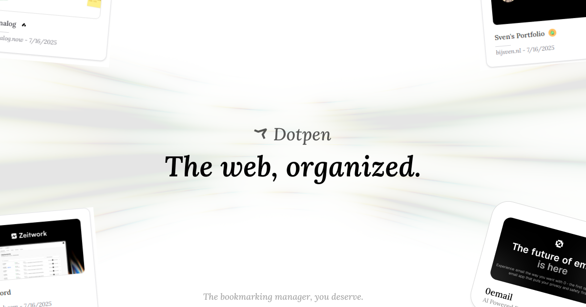

no noise — just a clean page to introduce Dotpen.  
built for people who want bookmarking to feel good again.

---

## what is this?

this is the public launch page for [dotpen.app](https://dotpen.app) —  
a distraction-free, privacy-first bookmarking tool for the web.

- ✨ clean and minimal interface  
- 🧠 AI that organizes for you  
- 🔌 plugin support from day one  
- 🌐 works on mobile, desktop, and everywhere in between  
- 🛡️ privacy-first, no tracking — ever

---

## join the waitlist

we’re slowly rolling out access to early testers.  
sign up at [dotpen.app](https://dotpen.app) to reserve your spot.  
you’ll be the first to hear when we launch public beta.

---

## why we made this

bookmarks are broken. tabs pile up.  
link managers feel bloated or abandoned.

dotpen is different —  
a tool that fades into the background, but remembers everything for you.  
made for creatives, researchers, and anyone who touches the internet for a living.

---

## coming soon

- browser extensions  
- AI-powered tagging and sorting  
- shared libraries for teams  
- import from Chrome, Safari, Raindrop, Pocket & more

---

## license

code will be [open source](https://github.com/dotpenlabs/dotpen) —  
but this repo is just the static launch site.  
MIT licensed.

---

made with care by [dotpen labs](https://dotpen.app)
